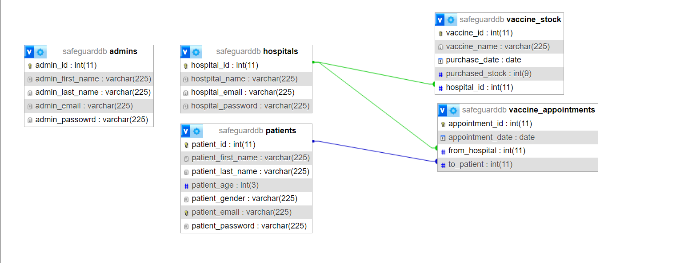

# Database Queries

1. CREATE DATABASE safeguarddb;

2. CREATE TABLE patients(
	patient_id INT PRIMARY KEY AUTO_INCREMENT,
    patient_first_name VARCHAR(225),
    patient_last_name VARCHAR(225),
    patient_age INT(3),
    patient_gender VARCHAR(225),
    patient_email VARCHAR(225) UNIQUE,
    patient_password VARCHAR(225)
);

CREATE TABLE hospitals(
    hospital_id INT PRIMARY KEY AUTO_INCREMENT,
    hostpital_name VARCHAR(225),
    hospital_email VARCHAR(225),
    hospital_password VARCHAR(225)
);

CREATE TABLE admins(
    admin_id INT PRIMARY KEY AUTO_INCREMENT,
    admin_first_name VARCHAR(225),
    admin_last_name VARCHAR(225),
    admin_email VARCHAR(225),
    admin_password VARCHAR(225)
);

CREATE TABLE vaccine_stock (
    vaccine_id INT PRIMARY KEY AUTO_INCREMENT,
    vaccine_name VARCHAR(225),
    purchase_date DATE,
    purchased_stock INT(9),
    hospital_id INT,
    FOREIGN KEY (hospital_id) REFERENCES hospitals(hospital_id)
);

CREATE TABLE vaccine_appointments(
	appointment_id INT PRIMARY KEY AUTO_INCREMENT,
    appointment_date DATE,
    from_hospital INT,
	to_patient INT,
	FOREIGN KEY (from_hospital) REFERENCES hospitals(hospital_id),
    FOREIGN KEY (to_patient) REFERENCES patients(patient_id)
);

3. INSERT INTO admins VALUES (NULL, "Syed", "Hassam", "hassam@gmail.com", "hassam"), (NULL, "Farhan", "Jamil", "farhan@gmail.com", "farhan");

## Notes for Hassam
1. Add hospital forign key to vaccine_stock

